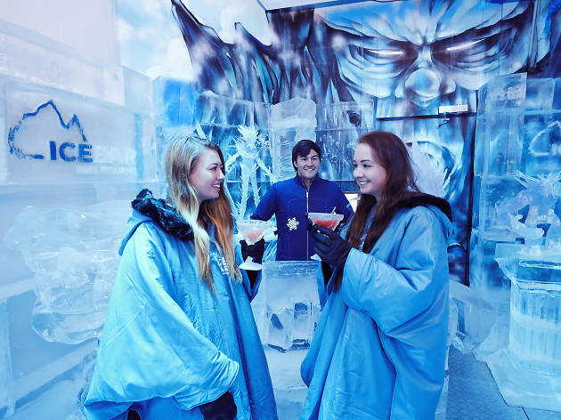
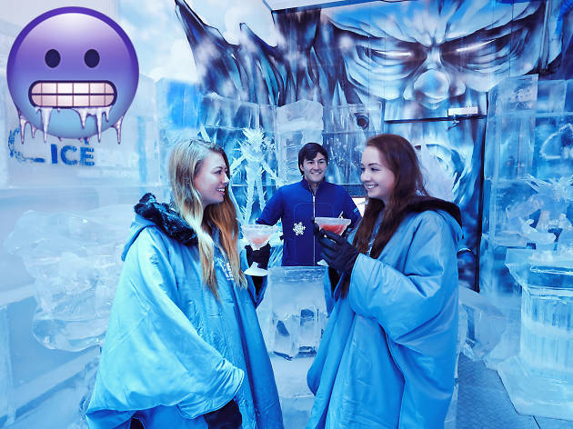

# Cloudinary's Guess the Transformation Challenge: Full Stack Fest Barcelona 2019

### This challenge involves guessing a Cloudinary transformation URL that produces a given target image from one \(or more\) given source image\(s\).

## Source Images:

#### Source image \#1: [https://res.cloudinary.com/demo/image/upload/icebar-friends.jpg](https://res.cloudinary.com/demo/image/upload/icebar-friends.jpg)

#### Source image \#2: [https://res.cloudinary.com/demo/image/upload/freezing-face-emoji.png](https://res.cloudinary.com/demo/image/upload/freezing-face-emoji.png)

## **W**arm-Up Transformation Example: 

#### [https://res.cloudinary.com/demo/image/upload/l\_freezing-face-emoji,e\_tint:50:purple,g\_north\_west/icebar-friends.jpg](https://res.cloudinary.com/demo/image/upload/l_freezing-face-emoji,e_tint:50:purple,g_north_west/icebar-friends.jpg)

##                                          NOW YOU TRY! 😀



